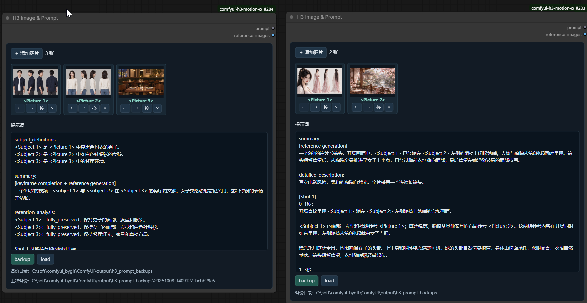
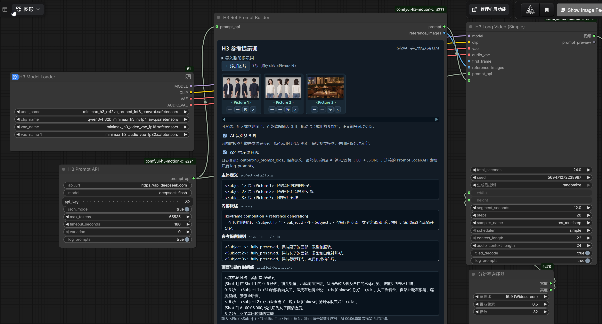
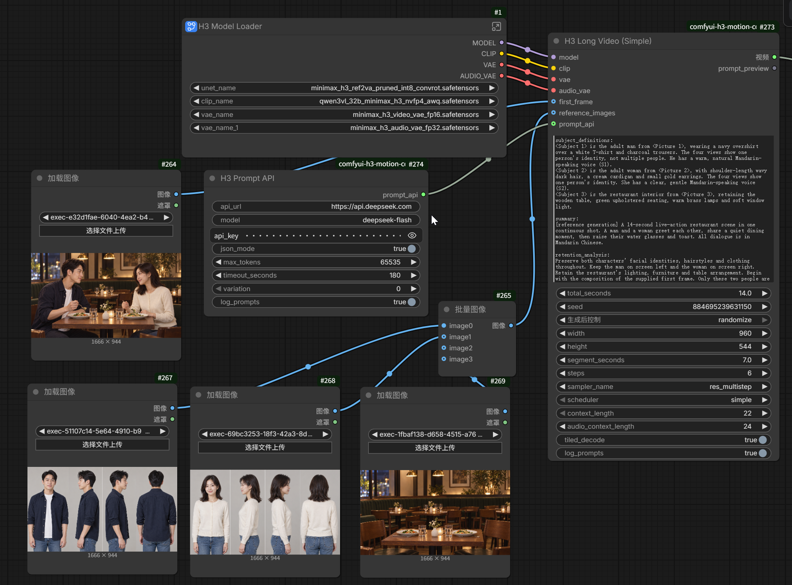

# H3 Motion Context

[English](README.md)

一份提示词、一个总时长，生成 MiniMax H3 长视频。基于 [NikoDemon80/ComfyUI-H3-Motion-Context](https://github.com/NikoDemon80/ComfyUI-H3-Motion-Context)，增加参考提示词编辑和自动分段生成。

安装到 `ComfyUI/custom_nodes` 后重启并刷新浏览器；需要支持原生 H3 和 **Concatenate Video** 的 ComfyUI。

```sh
git clone https://github.com/ooizj/ComfyUI-H3-Motion-Context.git comfyui-h3-motion-context
```

示例工作流：

- [H3 Long Video - Simple](example_workflows/H3%20Long%20Video%20-%20Simple.json)：直接填写提示词，使用图片加载节点输入首帧和参考图。
- [H3 Long Video - Ref Prompt Builder](example_workflows/H3%20Long%20Video%20-%20Ref%20Prompt%20Builder.json)：使用参考提示词编辑器管理图片和六段提示词，再连接长视频节点。

导入后选择本机模型和图片；示例保留了模型子图中的 LoRA / 注意力设置，请按本机安装调整。Builder 示例还包含分辨率选择器，未安装时可直接设置 Long Video 的宽高。发布文件中的 API 密钥已清空，需要调用时再填写自己的密钥。

## H3 Image & Prompt

[](docs/images/image-and-prompt.png)

在 `video/minimax` 分类中添加。包含图片区、提示词输入框、**backup** 和 **load** 按钮；支持多选、拖入、粘贴、替换和箭头排序。点击缩略图插入 `<Picture N>`，排序时同步更新提示词中的编号。

输出 `prompt`（提示词原文）和 `reference_images`（按界面顺序排列的图片），可直接连接生成节点。图片尺寸不同时与 Ref Prompt Builder 一样补边组批，不裁切；没有图片时仍可单独输出提示词。

点击 **backup** 直接保存，无需运行队列。固定目录为 `ComfyUI/output/h3_prompt_backups`（跟随 ComfyUI 输出目录），节点显示完整路径。每次创建独立的时间戳子目录，包含原图 `Picture_01.*` 等、原文 `prompt.txt` 和记录图片顺序、来源及哈希的 `manifest.json`；不会覆盖旧备份。图片和提示词也随工作流保存，普通运行不会自动备份。

点击 **load** 浏览备份，按时间倒序显示缩略图、图片数量和提示词摘要。选中后可预览全部图片和完整提示词，再点击 **载入所选备份** 替换节点内容；取消不改动当前内容。载入使用备份中的图片副本，不依赖原来的上传图片。

## H3 Ref Prompt Builder

[](docs/images/ref-prompt-builder.png)

在 `video/minimax` 分类中添加。用于管理参考图和编辑 Ref2VA 六段提示词，手动填写即可使用。

1. 添加、拖入或粘贴参考图，顺序对应 `<Picture 1>`、`<Picture 2>` 等。拖动卡片或点击箭头排序时，正文中的图片编号同步更新；**换**用于替换图片并保留编号。
2. 填写六个字段。点击缩略图插入引用，或输入 `<Pic` / `<Sub` 后用方向键、Tab / Enter 补全。`<Subject N>` 是主体编号，需明确其来源图片，不要求与图片编号相同。
3. 将 `prompt` 和 `reference_images` 接到 Long Video 的同名输入，检查预览后运行。需要时将 Long Video 的 `prompt` 文本控件转换为输入接口。

| 字段 | 内容 |
| --- | --- |
| `subject_definitions` 主体定义 | 人物、场景等主体的特征及来源，例如 `<Subject 1> 是 <Picture 1> 中穿深色衬衫的男子。` |
| `summary` 内容概述 | 视频的主要事件；使用 `[reference generation]`，有首帧或关键帧时使用 `[keyframe completion + reference generation]`。 |
| `retention_analysis` 参考保留规则 | 参考图中需要保留的身份、服装、环境等特征。 |
| `detailed_description` 画面与动作时间线 | 构图、动作、运镜、对白和局部音效，时间按最终整片视频填写。 |
| `overall_soundscape` 整体环境声 | 贯穿视频的环境底声与总体听感。 |
| `non_diegetic_music` 背景音乐 | 音乐要求；不要音乐时填写 `N/A`。 |

开场写 `[Shot 1]`，六秒切镜写 `[Shot 2] At 00:06.000, ...`；`0–3 秒：……` 是事件时间段，不等于切镜。提示词总时长与 Long Video 的 `total_seconds` 保持一致。

**界面语言：**编辑器、节点说明和 tooltip 跟随 ComfyUI 的语言设置：中文环境显示中文，其他语言显示英文。

**导入整段提示词：**展开导入区，**按标题拆分填入**可按上表六个英文字段名拆分，无需 API；支持 Markdown 标题和冒号。普通描述可用 **AI 转成六段**。也可点击 **填入示例** 后修改。

**AI 整理：**把 H3 Prompt API 接到 Builder 的 `prompt_api`，点击 **AI 整理**或 **AI 转成六段**才会请求 API；只排队处理提示词，不启动视频生成。结果回填后可继续修改或撤销；等待期间编辑过原文，则点击 **应用 AI 结果**后才替换。普通运行、手动编辑、按标题导入都不会调用 API。

**AI 输出语言：**用 English / 中文 切换按钮单独设置，默认 English，符合 H3 官方 Ref2VA 格式；也可选中文。台词、歌词和画面文字始终保留原语言。选择随节点保存，并作为新建节点的默认值。

**AI 识别参考图：**默认开启，将图片按顺序压缩为最长边不超过 1024px 的 JPEG 副本发送给视觉模型。纯文字模型请关闭。视频生成仍使用源图片，尺寸不同时补边组批。

## H3 Long Video (Simple)

[](docs/images/long-video-connections.png)

连接四路模型，填写整片提示词和总时长，`VIDEO` 接 **Save Video**。节点自动计算段数、采样、利用上一段的视频/音频 latent 续接、裁掉重叠并以 **24 fps** 拼接。

- `first_frame`：可选首帧，只用于第一段开场。
- `reference_images`：可选参考图，按 `<Picture N>` 顺序作用于所有段；可来自 Builder，也可用 Batch Images 组批。连接参考图时使用 Ref2VA 模型，否则使用兼容的 FL2VA/T2VA 模型。
- `prompt_api`：可选的自动提示词拆分配置。无需拆分提示词时保持未连接。
- `prompt_preview`：输出实际各段提示词和时间窗口，可接文本显示节点查看。

| 参数 | 默认值 | 用途 |
| --- | --- | --- |
| `total_seconds` | `30` | 最终视频总时长。 |
| `segment_seconds` | `15` | 每段采样目标时长，包含重叠；实际段长会受帧对齐及对白保护影响。 |
| `width` / `height` | `960` / `544` | 输出尺寸，向上对齐到 32 的倍数。 |
| `seed` | `0` | 各段使用 `seed + 段索引`，索引从 0 开始。 |
| `steps` | `20` | 每段采样步数。 |
| `sampler_name` / `scheduler` | `res_multistep` / `simple` | 采样器与调度器。 |
| `context_length` | `22` | 视频续接的重叠帧数，可选 `5`、`22`、`39`、`56`。 |
| `audio_context_length` | `24` | 音频续接窗口，以视频帧为单位；`0` 跟随视频重叠。 |
| `tiled_decode` | `true` | 分块解码，降低解码显存。 |

例如图中的 `total_seconds=14`、`segment_seconds=7` 表示分段生成一条约 14 秒的视频，段数无需手填。较短的分段通常可降低单次采样显存，但会增加编码、解码和续接开销，不一定更快。

### 为什么要拆分提示词

长视频按短段分别采样，每段都有从零开始的局部时间。若每段都收到整片剧情，后续段可能重复开场动作或对白，也可能把整片时间误当成当前段的时间。

连接 `prompt_api` 后，节点先分析时间线和对白，再把整片提示词改写成各段需要的内容，将整片时间换算为段内时间，并计入重叠窗口；必要时调整分段边界，避免从一句对白中间切开。建议在原提示词里写清整片时间段和对白；没写时间时，按剧情顺序把内容分配到各段。分段提示词沿用原文的描述语言。

**不需要拆分提示词时，断开 Long Video 的 `prompt_api` 即可：仍会自动分段生成视频，每段复用原提示词，整个视频生成过程不会调用提示词 API。**

| 情况 | Long Video 是否调用 API |
| --- | --- |
| 未连接 `prompt_api` | 不调用，不拆分提示词。 |
| 实际只需生成一段，即使已连接 `prompt_api` | 不调用，直接使用原提示词。 |
| 已连接 `prompt_api`，且需要多段 | 调用 API 分析时间线，再改写各段提示词。没有明确时间时，按剧情顺序把内容分配到各段。 |

Builder 的 AI 按钮是独立操作；点击时仍会调用它所连接的 API。仅仅不写时间戳不等于关闭 API，要跳过自动提示词拆分，应断开 Long Video 的 `prompt_api`。

启用 `log_prompts` 后，日志保存在 `output/h3_prompt_logs/`（TXT + JSON）：`*_builder` 是编辑器输入/输出，`*_planner` 是 API 规划记录，`*_video` 是采样前确定的各段提示词与设置。Builder 日志还需所连接 API 的 `log_prompts` 开启；`prepared` 仅表示准备采样。密钥遮罩只隐藏显示，分享工作流前应清空实际密钥字段。

[GPL-3.0 许可证](LICENSE)
